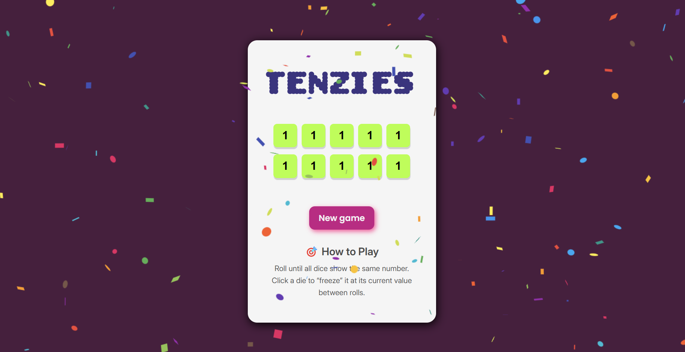

# 🎲 Tenzies Game

A fun and interactive dice game built with React! 🎉  
The goal is to roll until **all dice are the same number**. Click on a die to "freeze" its value between rolls. When all dice match, confetti bursts to celebrate your win!

---

## 📸 Preview

---

## 🚀 Features

- 🎲 10 dice rendered dynamically
- 🎯 Click to hold/freeze dice values
- 🎲 Roll only unheld dice
- 🎉 Confetti celebration on game win
- 🧠 Simple game logic with clear UI
- 🔁 Option to restart and play again

---

## 🛠️ Built With

- React (Functional Components & Hooks)
- CSS for styling